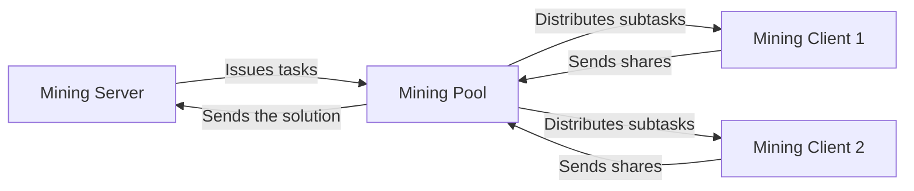

# Mining Project: SHA-256/ECDSA Mining Simulation


> ⛏️ The project demonstrates the operation of the Proof-of-Work algorithm (similar to Bitcoin) using SHA-256 for mining and ECDSA for authentication. The system consists of three components: a central server (issuing tasks), a pool (aggregating the power of miners) and clients (performing calculations). The goal of the project is to clearly demonstrate the process of distributed mining with difficulty adjustment and pool rewards.

The project including three main components:
- **Mining Server** - Central server (replaces blockchain)
- **Mining Pool** - Pool for aggregating computing power
- **Mining Client** - Client for calculating hashes

## 📦 System architecture

## ⚙️ Technical requirements
• .NET 9.0 SDK

• ОС: Windows/Linux/macOS

• 500 MB free space

• Ports: 5000 (Server), 12000 (Pool), free ports for clients

## 🚀 Launch of the project
1. Building the Basic Library
```bash
cd Data
dotnet publish -c Release
```

2. Launching Mining Server
```bash
cd MiningServer
dotnet run
```
Configuration (Program.cs):

• Port: 5000

• Database: chain.db (automatically created)

• JWT Secret: .EG3N@m1mDc3IQ4A^4J^k36X~w!A+S&s (given as an example)

3. Launch of Mining Pool
```bash
cd MiningPool
dotnet run
```
Configuration (Program.cs):

• Server URL: ```http://localhost:5000/miningHub```

• Pool port: 12000

• Pool ID: pool1

4. Launching Mining Client
```bash
cd MiningClient
dotnet run
```
Configuration (Program.cs):

• Pool URL: ```http://192.168.0.101:12000/poolHub``` (change to your IP)
## 🔧 Setting up the environment
To change the parameters, edit:
1. **Server**: `MiningServer/Program.cs`
   - `jwtSecret`
   - Port to `app.RunAsync()`
2. **Pool**: `MiningPool/Program.cs`
   - `jwtSecret`
   - `poolId`
   - Server URL
3. **Client**: `MiningClient/Program.cs`
   - Pool URL

## 📊 Example of work
**Server log:**
```
[Info] Block #125 mined by pool1! Reward: 100, New Difficulty: 6
```
**Pool log:**
```
[Info] Client [ID] assigned nonce range: 0-100000000
[Info] Client [ID] gets 25 tokens for 50 shares
```
**Client log:**
```
[Info] Hashrate: 15.72 MH/s, Shares: 8.34 shares/min
[Info] Submitted share: nonce=48392741, hash=0000a3fd...
```

## 🧠 Key Components

### General (Data)
- **Block.cs**: Block logic (mining, verification)
- **EcdsaAuth.cs**: ECDSA key generation and signature
- **Utils.cs**: JWT token generation

### Server
- **MiningServer.cs**: 
  - Blockchain management (SQLite)
  - Difficulty adjustment
  - Pool rewards

### Pool
- **MiningPool.cs**:
  - Nonce range distribution
  - Shares validation
  - Load balancing

### Client
- **MiningClient.cs**:
  - Parallel mining (Parallel.For)
  - Real-time statistics
  - Auto-connection when disconnected

## 🔒 Security
- Authentication via ECDSA
- JWT tokens for communication
- Verification of signatures of all messages
- Protection against replay attacks (timestamp)

## 📄 License
GPL3 License.
